# 👋 Olá! Eu sou Éder Oliveira de Rosso  

📚 **Professor de Informática e Tecnologia da Informação**  
🎓 **Formado em Análise e Desenvolvimento de Sistemas**

Bem-vindo ao meu GitHub! Aqui compartilho projetos, atividades acadêmicas e práticas que desenvolvi durante minha graduação e como professor.  
Você encontrará conteúdos sobre desenvolvimento web, programação e soluções tecnológicas.

Sou apaixonado por aprender, ensinar e compartilhar conhecimento em tecnologia! 🚀

---

## 💼 Projetos em Destaque

### ⚖️ [LexFlow — Sistema de Gestão Jurídica](https://github.com/EderRosso/advocacia-system)
Plataforma completa para escritórios de advocacia: processos, prazos, financeiro, CRM, Kanban de tarefas e PWA com modo escuro.  
`PHP` `MySQL` `PWA`

### 💼 [JurisWeb](https://github.com/EderRosso/JurisWeb)
SaaS de gestão jurídica com CRM de captação de clientes, geração de contratos/petições e dashboard financeiro em tempo real.  
`React` `Node.js` `Express` `JWT`

### 🔎 [procurAqui](https://github.com/EderRosso/procurAqui) · [demo ao vivo](https://procur-aqui.vercel.app)
Aplicação web em produção com integração de pagamentos e recursos premium.  
`JavaScript` `Vercel`

### 📰 [BlogPHP](https://github.com/EderRosso/BlogPHP)
Plataforma de blog (blogERSTEC) publicada via GitHub Pages.  
`PHP` `CSS`

### 🎓 [PortfolioProfEder](https://github.com/EderRosso/PortfolioProfEder)
Material didático criado para ensinar HTML/CSS semântico e boas práticas de Git aos alunos.  
`HTML` `CSS` `Educação`

### ⚛️ [organograma](https://github.com/EderRosso/organograma)
Projeto do curso de React da Alura, praticando componentes e hooks.  
`React` `JavaScript`

---

## 🚀 Tecnologias que domino

    
        
            
                
                    
                        
                            
                                
                                    
                                        
                                            

---

## 📈 GitHub Stats

---

## 🌐 Contatos

---

💡 *"A tecnologia move o mundo, e compartilhar conhecimento o transforma. Vamos aprender juntos!"*  
